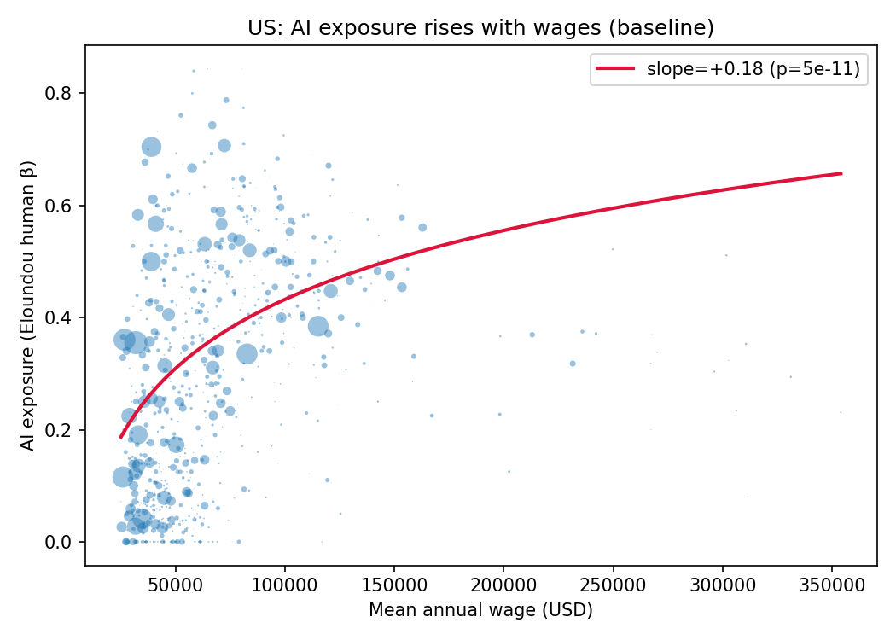
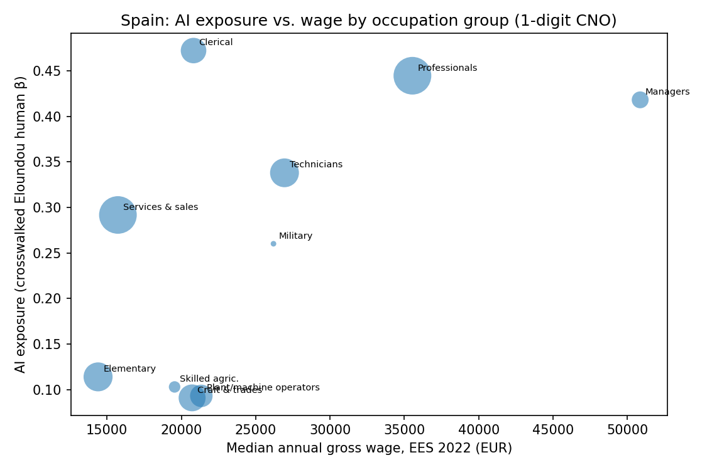

# AI Exposure of the Spanish Labour Market


**Who is most exposed to generative AI in Spain — and does the US "high-skill-biased"
pattern survive in a more services- and tourism-weighted economy?**

This repository carries the established US occupational AI-exposure scores
(Eloundou et al., *GPTs are GPTs*, **Science 2024**) onto Spanish occupations through
an auditable classification crosswalk, then combines them with two Spanish official
microdata sources — the labour-force survey (EPA) and the structure-of-earnings
survey (EES) — to ask **who is exposed, and how exposure relates to pay**.

Everything is reproducible: the US benchmark runs from auto-downloaded data, and the
Spanish analysis runs from two INE microdata files you place in `data/raw/`.

---

## Key findings

| | 🇺🇸 United States | 🇪🇸 Spain |
|---|---|---|
| Employment-weighted **mean exposure** | 0.32 | **0.29** |
| **Wage–exposure gradient** (∂exposure/∂log-wage) | +0.18 (p≈5e-11) | +0.24 (p≈0.002) |
| Most exposed | Cognitive / white-collar occupations | Clerical, professionals, managers, technicians |
| Least exposed | Manual / physical occupations | Craft, machine operators, agriculture, elementary |

**Spain mirrors the US high-skill-biased pattern**: AI exposure rises with
occupational pay. The most exposed Spanish workers are in clerical and professional
roles; the least exposed are in manual trades. At the worker level (240k EES
records), occupations with higher exposure pay a substantial wage premium even after
controlling for sex, education, sector and job type.

| 🇺🇸 US baseline | 🇪🇸 Spain |
|---|---|
|  |  |

> **Honest caveat.** Spain's *public* microdata anonymises occupation to **major
> groups** (10 in EPA, 17 in EES). The exposure–wage *gradient* is robust to this,
> but a fine "share of workers highly exposed" headline is **not identified** at this
> resolution and is deliberately not reported. True 2-digit occupation (~65 groups)
> requires an INE custom-file (*fichero a medida*) request — see [Roadmap](#roadmap).

---

## How it works

Exposure is defined at US SOC; Spanish data is coded in CNO-2011. The bridge is a
four-hop, fully auditable crosswalk, with coverage checked at every step:

```
Eloundou exposure (US SOC-2018)
        │  BLS 2010↔2018 SOC
        ▼
   SOC-2010
        │  eworx iscoCrosswalks (SOC-2010 ↔ ISCO-08)
        ▼
   ISCO-08
        │  INE "CNO-11 ↔ CIUO-08" correspondence
        ▼
   CNO-2011  ──aggregate──▶  CNO major group
                                   │
        ┌──────────────────────────┼──────────────────────────┐
        ▼                                                       ▼
  EPA 2026Q1                                              EES 2022 microdata
  employment by occupation                          individual gross earnings
  (22.3M workers)                                   (240k workers; median, P90/P10)
```

Each hop is a many-to-many correspondence collapsed by an (optionally weighted) mean,
implemented and unit-tested in [`src/crosswalk.py`](src/crosswalk.py).

---

## Reproduce

```bash
python -m venv .venv && source .venv/bin/activate
pip install -r requirements.txt
```

**US baseline — runs immediately (data auto-fetched):**

```bash
python -m scripts.download_data     # fetches Eloundou scores + BLS OEWS + crosswalks
python -m scripts.run_us_baseline   # -> figures/wage_vs_exposure_US.png
```

**Spain — needs two INE microdata files in `data/raw/`** (see
[`scripts/download_data.py`](scripts/download_data.py) for exact sources):

```
data/raw/EPA_2026T1.sav     # INE Labour Force Survey microdata (any quarter)
data/raw/EES_2022.sav       # INE Structure of Earnings Survey 2022 microdata
```

```bash
python -m scripts.run_spain         # -> figures/wage_vs_exposure_ES.png
```

**Tests** (crosswalk logic): `pytest -q` (or run `python -m src.crosswalk` for a
smoke test on toy data).

---

## Results in detail

### US baseline
Eloundou human-β exposure × BLS OEWS (May 2021); 767 detailed occupations, 130.6M
workers.

| metric | value |
|---|---|
| Employment-weighted mean exposure | 0.32 |
| Share of US employment ≥0.5 exposure | 24.0% |
| Wage–exposure gradient | +0.18 (p≈5e-11) |

### Spain (1-digit CNO)
Exposure crosswalked to CNO; employment from EPA 2026Q1; wages from EES-2022 microdata.

| Occupation group | Employment | Exposure | Median wage | P90/P10 |
|---|---:|---:|---:|---:|
| Clerical | 9.5% | **0.47** | €20.8k | 4.5 |
| Professionals | 20.8% | 0.44 | €35.5k | 5.4 |
| Managers | 4.2% | 0.42 | €50.9k | 4.0 |
| Technicians | 12.2% | 0.34 | €26.9k | 5.6 |
| Services & sales | 20.7% | 0.29 | €15.7k | 5.8 |
| Elementary / Craft / Operators / Agriculture | ~32% | 0.09–0.11 | €14–21k | — |

- **Group-level wage–exposure gradient (n=10): +0.24 (p≈0.002).**
- **Worker-level (240k records):** occupations with higher exposure pay a large
  conditional wage premium, controlling for sex / education / sector / job type.
  *Reported as a descriptive association only* — exposure varies across just 10
  occupation groups, so standard errors are optimistic (effective clusters ≈ 10).

---

## Data sources

| Input | Source | Access |
|---|---|---|
| AI exposure scores (US SOC) | Eloundou et al., *GPTs are GPTs* (Science 2024) | [openai/GPTs-are-GPTs](https://github.com/openai/GPTs-are-GPTs) — auto |
| US employment & wages | BLS OEWS (national, May 2021) | via OpenAI repo — auto |
| SOC-2010 ↔ SOC-2018 | US BLS | auto |
| SOC-2010 ↔ ISCO-08 | [eworx-org/iscoCrosswalks](https://github.com/eworx-org/iscoCrosswalks) | auto |
| ISCO-08 ↔ CNO-2011 | INE clasificaciones ("CNO-11 con CIUO-08") | manual |
| Employment by occupation | INE — Encuesta de Población Activa (EPA) microdata | manual |
| Wages by occupation | INE — Encuesta de Estructura Salarial (EES) 2022 microdata | manual |

All raw data is `.gitignore`d; the repo ships only code and the output figures.

---

## Repository layout

```
src/
  config.py        paths, classification levels, model ids
  crosswalk.py     SOC → ISCO → CNO mapping  (unit-tested)
  data_loading.py  loaders for every source, normalised columns
  exposure.py      occupation-panel construction + wage–exposure regression
  llm_scoring.py   Claude-on-ESCO scoring + validation  (roadmap; see below)
scripts/
  download_data.py        documents & auto-fetches all stable sources
  run_us_baseline.py      US benchmark, end-to-end
  run_spain.py            Spanish crosswalk + EPA/EES analysis, end-to-end
notebooks/         exploratory crosswalk / EDA / model notebooks
tests/             pytest for the crosswalk logic
figures/           output charts (tracked)
```

---

## Roadmap

- **2-digit occupation.** Request the INE *fichero a medida* to obtain occupation at
  CNO 2-digit (~65 groups), which would identify the "share of employment highly
  exposed" headline and support a proper occupation-level regression.
- **Claude-as-annotator (methodological extension).** Score AI exposure directly on
  the European **ESCO** taxonomy with Claude using the Eloundou rubric, then validate
  against the crosswalked human scores (rank/level agreement). Scaffolded in
  [`src/llm_scoring.py`](src/llm_scoring.py); not yet run. This would remove the
  US-classification detour entirely and produce ISCO-native exposure scores.
- **Temporal layer.** Use EPA 2024Q1 vs. 2026Q1 to look at employment shifts across
  the ChatGPT-diffusion window.

---

## Limitations

- **Occupation granularity** is capped at major groups by Spanish public microdata
  (see caveat above).
- Crosswalks are many-to-many; aggregation introduces measurement error, mitigated by
  per-hop coverage diagnostics (printed at runtime).
- **"Exposure" is technical potential**, not realised adoption or labour demand — an
  upper bound on disruption, not a forecast.
- The worker-level wage premium is an association, not a causal estimate.

---

## Author

**Daniel Torres González** — Mathematics & Economics double-degree student.
[github.com/dantor03](https://github.com/dantor03)

*Code released under the MIT License. Datasets remain subject to their providers' terms.*
